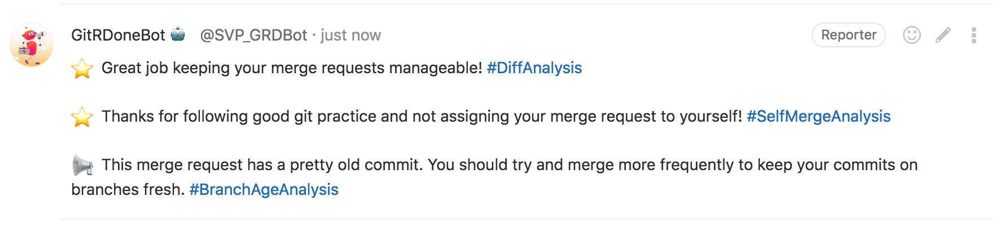

# GitRDoneBot for GitLab


As an engineer learns by trial and error, does feedback always cement good habits? Can we guarantee feedback at key moments and ensure it is actionable, timely, and beneficial? It turns out, reinforcement learning is not just for machines. GitRDoneBot helps proliferate good git practice by providing real-time feedback via automated merge request comments using principles derived from publications.

# Why GitRDoneBot?

Our story started with the question: What has been proven to improve code quality? Although many of us can draw from our own experiences, we turned to academia and the open-source community for tried and tested answers.

We were surprised to find that in the realm of Empirical Software Engineering there are not many knowns. [Hillel Wayne](https://www.hillelwayne.com/talks/what-we-know-we-dont-know/) puts it best when he says,

> “Almost everything in software is a belief. It is something we have experience on. But is it not something where we have hard data. In most cases we just don’t know.”

While arguments for smaller functions and unit test coverage leave us with [mixed results](https://www.duo.uio.no/bitstream/handle/10852/51127/master.pdf), one thing that we know improves code is **code review**.
In [Best Kept Secrets of Peer Code Review](https://static1.smartbear.co/smartbear/media/pdfs/best-kept-secrets-of-peer-code-review_redirected.pdf), one study determined that code review would have saved half the cost of fixing the bugs - \$152K - for a project, plus they would have found 162 additional bugs!
Improvements in code quality can also include:

1. Clearer communication about code content
2. Education of junior programmers
3. Shorter development cycles
4. Reduced impact on technical support
5. More maintainable code

Increased **coverage, participation, and expertise** shared during a review are [significantly linked with improved software quality](https://link.springer.com/article/10.1007/s10664-015-9381-9#:~:text=Prior%20work%20has%20shown%20that,the%20quality%20of%20delivered%20software.&text=Hence%2C%20our%20results%20empirically%20confirm,systems%20using%20modern%20reviewing%20tools.). GitRDoneBot influences these 3 human factors of meaningful code review via real-time relevant comments like the one below. In doing so, GitRDoneBot helps software engineers of all experience levels understand, develop, and hone habits that will lead them to success.



# What meaningful code review habits does GitRDoneBot reinforce?

## Diff Analysis
### Merge Requests Contain a Manageable Number of Changes: _1 - 500 Lines of Diff_

This not only aids in keeping coverage high, but also the human brain can only process [500 lines of code (LOC) at one time](https://static1.smartbear.co/smartbear/media/pdfs/best-kept-secrets-of-peer-code-review_redirected.pdf) and most MRs for open source projects are [less than 20 lines long](www.gousios.gr/pub/exploration-pullreqs.pdf).

## Branch Age Analysis
#### Merge Requests Contain Short-Lived Branches: _1 - 14 days_

The combination of trunk-based development with short-lived feature branches [accelerates code development, especially for asynchronous and large teams](trunkbaseddevelopment.com/short-lived-feature-branches).

## Self Merge Analysis
#### Merge Requests are Reviewed by Another Person: _Not self-assigned or self-merged_

Not only would this negate code review in general, but the open-source community benefits from many eyes on code. Code should not be introduced to the main working branch without being [vetted by at least one other person](https://www.pitt.edu/~ckemerer/PSP_Data.pdf).

## Too Many Assigned Analysis
#### Merge Requests are Distributed Across the Team: _1 - 10 Requests assigned to a single person_

To remove bottlenecks, low quality reviews, increased context switching, and single-person dependencies, check to make sure that MR assignees don’t have too many other MRs on their plate.

## Commit Message
#### Commit messages are more than one word and adequate length: _4 - 50 characters in length_

Too many one word commits degrades the quality of your git history because they are not informative.

## New Git Who Dis
#### Merge Request author has a human readable name.

It’s really hard to reach out to someone who pushed commits if you don’t know who that person is!

## Git Outta Here
#### No log files are included in the changes of the Merge Request

Adding logs to a repo adds unnecessary content to the GitLab ecosystem and bloats commit changes.


# Hosting Your Own Bot: How do I use GitRDoneBot for my team/organization?

## Local Setup

* npm install
* add a `.env` file
* If using VSCode
  * the `.vscode/extensions.json` file will load suggested extensions on first opening this project
  * the `.vscode/launch.json` file will provide test scripts that can be run using the built-in debugger tool

`.env`
```
AWS_ENV="dev"
GITLAB_BOT_ACCOUNT_NAME="${gitrdonebot-account-name}"
GITLAB_BOT_ACCOUNT_API_TOKEN="${service-account-api-token}"
GITLAB_TESTING_GROUP_NAME="grdbot-functional-tests"
GITLAB_BASE_URI="${gitlab-api-uri}"
```

> Note:
> We recommend calling the bot service account "GitRDoneBot", but feel free to name it anything you'd like!

## Hosting Requirements

As a serverless function written in TypeScript all GitRDoneBot needs to run is a serverless environment and a bot access token for the GitLab environment. To keep infrastructure options flexible, GitRDoneBot leverages the [Serverless Framework](https://www.npmjs.com/package/serverless) and provides a very basic `serverless.yml` file to get you started in AWS.

That means you need:

1. A Serverless, or FaaS (Function-as-a-Service), provider (e.g. AWS Lambda).
1. Ability to create a service account for GitLab and make an API access token.
1. Make the environment variables shown in the `.env` file below available to the serverless function at runtime.
1. A desire to improve code review practices!

> Note:
> The code base was designed to be modular enough that the `handler.ts` file could be swapped out for a simple REST framework if you choose to run GitRDoneBot in a container exposing a webhook endpoint instead of as a serverless function.

### AWS "Quick Start" Using Serverless 

The parameterized `serverless.yml` file included in this repo is provided to help you get started with an AWS deployment. 

If you would like to deploy to a different cloud provider, please see the [serverless documentation](https://www.serverless.com/framework/docs/providers/) for available providers.

You can create as many AWS environments as you want for testing purposes, by simply creating additional files in the `/env/` folder with the specific AWS account information for your target account(s). We suggest two environments: `dev` and `prod`.

You can toggle between different deployment environments using the `AWS_ENV` environment variable.

The `package.json` contains a script, `lambda`, to run serverless offline in your local environment for testing purposes.

You will need to create the VPC, security groups, and VPCE **before deploying with serverless**, and use those IDs to populate your serverless files. 

Serverless will handle the creation of:
* Private API Gateway
* Lambda function
* IAM role required to invoke the Lambda
* the log group to capture Lambda events

### Supported GitLab Version

GitRDoneBot currently supports GitLab API Version 4. The latest GitLab version it is confirmed to work with is 11.9.12-EE. There may be some differences between the Community & Enterprise Editions that could impact certain Bot Actions.

To test if GitRDoneBot will work with your GitLab instance:
1. Create a **public** namespace called `grdbot-functional-tests`.
1. Create a GitLab API access token.
	1. For testing purposes this can belong to your personal account, but should belong to service account defined in the environment variables for production hosting.
1. Update the `.env` file with the URI for your GitLab API instance and the token you just created.
1. Using VSCode, select `Component Builders: Live API` from the debugger dropdown menu and run it.
1. Any tests that fail should highlight specific API calls that are incompatible with your GitLab API instance.

## GitRDoneBot Flow & Architecture Diagram

GitRDoneBot is stateless. Instead of keeping a copy of data owned by GitLab it leverages the GitLab API when needed. For example, to determine if we need to leave a new comment or update one.


## End User Setup

Once you have the serverless function deployed, individual project teams can opt into using the bot by following these 3 steps in the GitLab GUI:

1. Add the GitRDoneBot GitLab user to the repo or group with Reporter access. **If your repo is public, you do not need to do this step**.
1. Under Settings -> Integrations, add a new "Merge request events" webhook which points to the serverless function HTTP endpoint.
1. If desired, users can customize some bot behaviors by dropping a `.grdb.json` file in the root of the repository.

### Want to customize GitRDoneBot's thresholds for your repo?

Simply follow these steps:

1. Add a new file to the root of your repository on the master branch named `.grdb.json`
2. Copy and paste the following JSON object into the `.grdb.json` file:

```
{
    "diffAnalysis": {
		"thresholdInLinesOfDiff": number,
		"constructiveFeedbackOnlyToggle": boolean
	},
	"branchAgeAnalysis": {
		"thresholdInDays": number,
		"constructiveFeedbackOnlyToggle": boolean
	},
	"tooManyMergeRequestsAnalysis": {
	    "thresholdNumberOfMergeRequests": number,
		"constructiveFeedbackOnlyToggle": boolean
	},
	"updateMergeRequestComment": boolean
}
```

3. Edit the thresholds that you want GitRDoneBot to compare against. Minimums are exclusive and maximums are inclusive.
   - Diff Analysis threshold value must be between 1 and 500. **Default**: `500`
   - Branch Age Analysis value must be between 1 and 14. **Default**: `7`
   - Too Many Merge Requests Analysis value must be between 1 and 10. **Default**: `3`
4. `updateMergeRequestComment` **Default**: `true`
   - `true` allows GitRDoneBot to update comments while a Merge Request is actively being worked on
   - `false` means GitRDoneBot will only leave immutable comments when Merge Requests are first opened and finally merged.
5. `constructiveFeedbackOnlyToggle` **Default**: `false`
   - `true` will only leave constructive comments when values fall outside thresholds
   - `false` will also leave congratulatory comments when criteria fall within threshold range.
   - TL;DR: `true` reduces chattiness and the number of notifications developers will receive.

> Note:
>
> - Non-existent or misspelled property names will be ignored and defaults will be used instead.
> - Custom thresholds outside of accepted ranges will be ignored and defaults will be used instead.
> - Once you have a valid `.grdb.json` file added to the master branch of your repository, GitRDoneBot will start using the thresholds you have set.

# Contributing

The bot creators would love to encourage anyone interested to contribute to this product! Issues and feature requests are appreciated. If there is some feature you would like to add, or a bug you find that you'd like to fix, please fork the project and open a Pull Request when your code is ready. If you have any questions about contributing, or any other aspect of GitRDoneBot, please reach out to the team!

## Code Overview

**Code documentation coming soon!**

The main components of the Bot are called **Bot Actions**. A Bot Action is a logical unit of service that analyzes one specific Merge Request behavior. Unique Bot Action functions are grouped together as modules in `src/bot_actions`. Each Bot Action returns a self-contained response that includes:

1. Information about API calls made
1. If good git practice is followed according to the rules set in that Action
1. The comment that will be posted as a note on the Merge Request.

The **Bot Actions Response** invokes all of the Bot Actions and composes them into a single response. This is what posts the comment and emoji on the Merge Request.

The Bot Actions Response is built in the main lambda handler (`handler.ts` in the root of the project) when the incoming event is a GitLab Merge Request event in `open`, `merge` or `update` states. This handler is very specific to AWS lambda and will need to be changed to accommodate other serverless providers.

This approach was adopted in an effort to keep the logic as loosely coupled as possible in order to make it easier to add new Bot Actions and improve testability of functional units.

## Tests

GitRDoneBot leverages the [Jest Framework](https://jestjs.io/) for delightful TypeScript testing. It uses tests at multiple levels with different granularity and dependencies to ensure quality:
1. `__tests__/unit_tests` for every component
2. `__tests__/component_builder_tests_with_mocks` to test at the bot action level, with no dependencies on GitLab's API
3. `__tests__/live_gitlab_api_tests` to test integration with the GitLab API and environment. These tests require projects and merge requests to exist in the specific GitLab instance and automation is built in to import everything necessary.

Run tests:
- Using the commands `npm run test:unit`, `npm run test:mock`, `npm run test:live`, or `npm run test:full` from the `package.json` file
- Using VS Code Run and the `.vscode/launch.json` provided
- In your CI/CD pipeline using the templatized `.gitlab-ci.yml` provided

## Static Code Analysis

- [Prettier](https://prettier.io/) and a `.prettierrc` configuration file keep things...pretty! 
- [ESLint](https://eslint.org/) performs static security analysis, prevents risky coding practices, and checks cyclomatic complexity.

## Documentation

- [TSDoc](https://github.com/microsoft/tsdoc) is the standard we use for doc comments in the TypeScript source files.
- [TypeDoc](https://typedoc.org/) generates documentation from the comments in the source code.